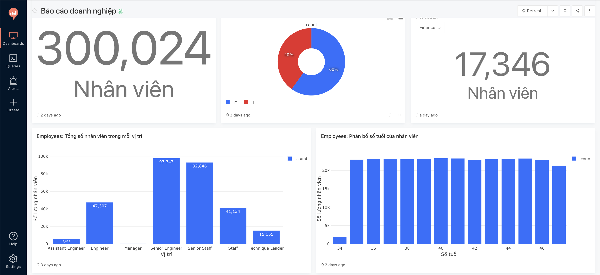
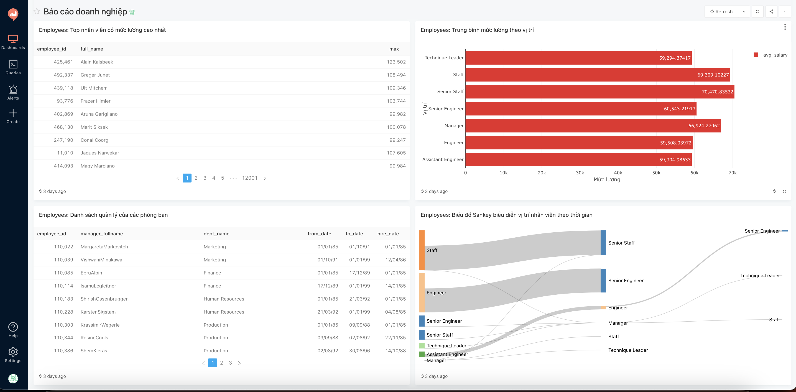

# Business-Intelligence-Dashboard
Redash là tool giúp truy vấn, trực quan hoá dữ liệu từ các nguồn dữ liệu khác nhau, cụ thể:
- Kết nối đến các nguồn dữ liệu SQL và NoSQL, chẳng hạn Postgresql, MySql, Mongo,...
- Truy vấn dữ liệu, chế độ lập lịch giúp tự động refresh truy vấn.
- Trực quan hoá dữ liệu và tạo báo cáo.
- Phân quyền người dùng truy cập đến nguồn dữ liệu và báo cáo.
- Customize: Kết nối đến các API.

## Cài đặt REDASH - TOOL VISUALIZE
Lưu ý: Redis, Database Postgresql có thể cài đặt bằng docker
### Cài đặt Redis 
* `brew install redis`
### Cài đặt Database
B1: Cài đặt database postgresql cho Macos
* `brew install postgresql`

B2: Tạo database `redash`, phân quyền người dùng cho Table
* sudo -u postgres psql
* CREATE DATABASE redash;
* CREATE USER admin WITH PASSWORD 'admin123456';
* GRANT ALL PRIVILEGES ON DATABASE redash TO admin;

### Cài đặt redash (Sử dụng Docker)
B1: Clone Project 
* `git clone https://github.com/quannm290898/Business-Intelligence-Tool.git`

B2: Tạo/sửa file môi trường .env
* Địa chỉ database, địa chỉ redis theo mẫu
* Database: `postgresql://<username>:<password>@<hostname>:5432/redash`
* Redis: `redis://<hostname>:6379/0`

B3: Tạo image redash sử dụng dockerfile
* `docker build -t redash:version2 -f Dockerfile .`

B4: Tạo bảng trong database `redash` (đã tạo)
* `docker-compose run --rm server create_db`

B5: Chạy redash:
* `docker-compose up -d`

B6: Địa chỉ giao diện redash: ip:5001

B7: Dừng service
* `docker-compose down`

### Các lỗi thường gặp trong cài đặt

Lỗi 1: Không kết nối được database đã tạo (port: 5432).
* `sudo vim /etc/postgresql/14/main/postgresql.conf`
* sửa `listen_addresses = "*"`
* `sudo vim /etc/postgresql/14/main/pg_hba.conf`
* khai báo `host: 0.0.0.0/0 md5`

Lỗi 2: Không kết nối được redis (cannot connect redis refuse)
* `sudo service redis-server status`
* `sudo vim /etc/redis/redis.conf`
* sửa `supervised systemd`

### Dashboard Demo

